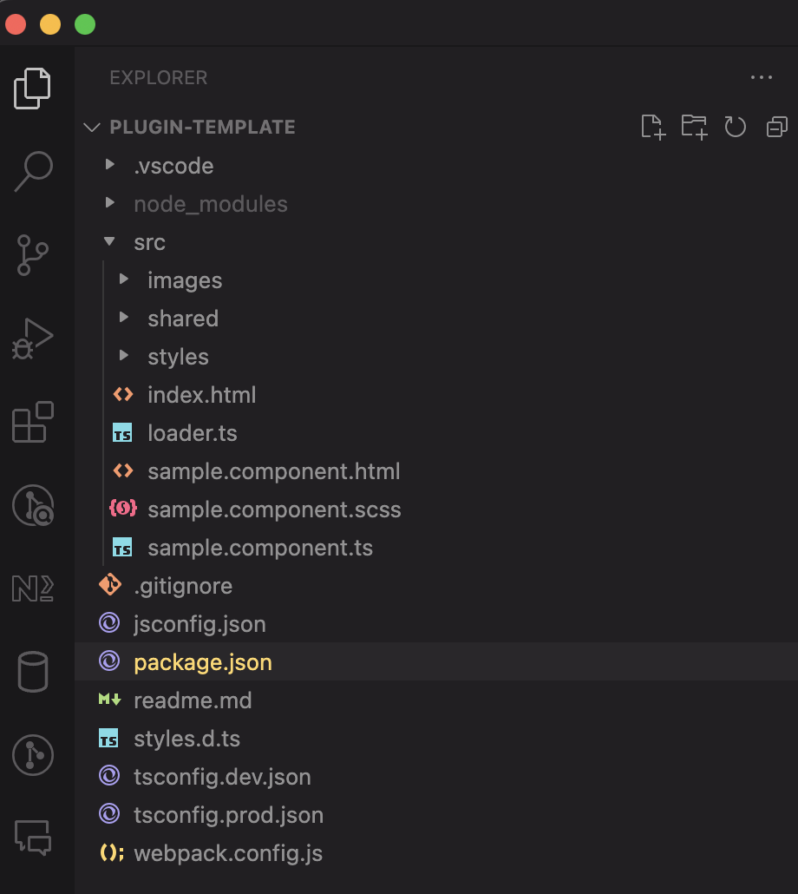

# Quick Start


**Good to know:** We have a couple of samples you can use as a basis to build your plugin as opposed to starting from scratch. This can save a lot of time.


## Get your plugin key

Publishing your plugin requires a unique plugin key. This will be provided on registration or can berequested through our support service.

## Installation

Firstly clone the public plugin-template repository and install project dependancies. The BitBucket URL is [https://bitbucket.org/prcode/plugin-template](https://bitbucket.org/prcode/plugin-template).&#x20;



```
# Clone repository
git clone https://bitbucket.org/prcode/plugin-template.git

# Install packages
npm install
```



We recommend you rename the folder where you cloned the repo to something that either contains your company name or relates to function the plugin performs e.g. <mark style="color:green;">**plugin-rotate**</mark> as this will be your plugin name also.

Now modify the package.json replacing the requisite fields:

```json
{
  "name": "Your plugin name",
  "private": false,
  "version": "0.0.1",
  "description": "Brief description of your plugin",
  "scripts": {
    ...
  },
  "author": "Your name",
  "dependencies": {
    "@roberts-studios/harness": "bitbucket:prcode/harness",
    "eslint": "^8.53.0"
  },
  "devDependencies": {
    ...
  }
}

```

You should leave <mark style="color:green;">**dependencies**</mark> and <mark style="color:green;">**devDependencies**</mark> alone unless you wish to add additional npm modules to support your plugin.

## Review Files

Your project should look like the following when opened in Visual Studio Code.&#x20;

<div align="left">

<figure><figcaption></figcaption></figure>

</div>

For further detail on the role of each file in the solution, please review Plugin Files.

## Run Project

You can run your plugin. When running the initial script it will build the project in development mode and launch the solution in the browser at http://localhost:8000



```
# Build and run 
npm start
```



You should now see the harness with the sample plugin loaded

<figure><figcaption></figcaption></figure>

